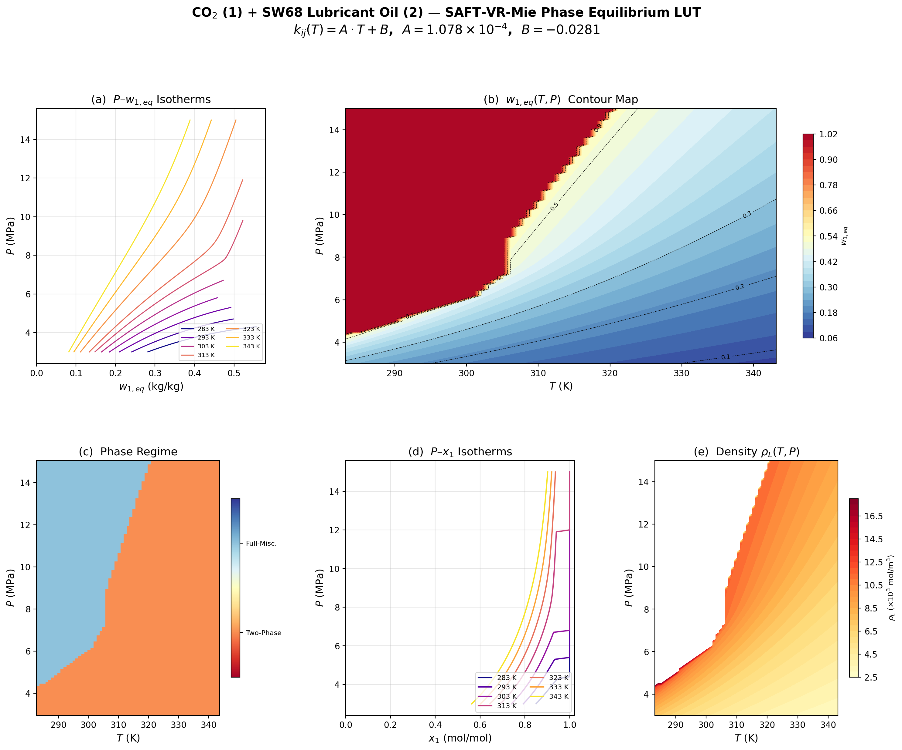

# CO2–Lubricant Non-Equilibrium Dissolution in Flow Heat Transfer Model

Computational framework for validating a non-equilibrium dissolution model of CO₂ in
polyol-ester (SW68) lubricating oil, using the SAFT-VR-Mie equation of state.

## Overview

The project implements a multi-scale validation chain for CO₂–oil mass transfer in
refrigeration/heat-pump systems:

| Step | Module | Output | Description |
|------|--------|--------|-------------|
| **1** | `calc_weq_lut` | `weq_lut.csv` | Local equilibrium solubility $w_{1,eq}(T,P)$ via phase equilibrium |
| **2** | `calc_taums` | `taums_lut.csv` | Mesoscopic mass-transfer relaxation time $\tau_{ms}(T,P,w_1)$ via free-volume theory |

The look-up tables (LUTs) are consumed by a macroscopic 1-D flow/heat-transfer solver
via bilinear interpolation, avoiding repeated EOS iterations at each grid node.

## Quick Start

### Prerequisites
- C++17 compiler (GCC 9+, Clang 10+, MSVC 2019+)
- CMake 3.14+ (optional, for build system)
- Python 3.8+ with `numpy`, `pandas`, `matplotlib`, `scipy` (for visualisation)

### Build & Run

```bash
# Direct compilation (autodiff headers in lib/)
g++ -std=c++17 -O2 -I lib src/calc_weq_lut.cpp src/saft_mie.cpp -o calc_weq_lut
g++ -std=c++17 -O2 -I lib src/calc_taums.cpp  src/saft_mie.cpp -o calc_taums

# Step 1: Generate equilibrium solubility LUT
./calc_weq_lut          # produces weq_lut.csv

# Step 2: Generate transport tau_ms LUT (requires weq_lut.csv from Step 1)
./calc_taums            # produces taums_lut.csv

# Visualisation
python scripts/plot_weq.py      # solubility figures
python scripts/plot_taums.py    # transport figures
```

Or with CMake:

```bash
mkdir build && cd build
cmake .. && make
./calc_weq_lut && ./calc_taums
```

### Output Data

| File | Rows | Columns |
|------|------|---------|
| `weq_lut.csv` | 7,381 (61 T × 121 P) | T, P, x₁, w_{1,eq}, ρ_L, φ₁^V, φ₁^L |
| `taums_lut.csv` | 4,718 (two-phase subset) | T, P, x₁, w₁, ρ, D₁₂, μ, Re, Sc, Sh, τ_ms |

### Key Parameters

| Property | CO₂ | SW68 Oil |
|----------|-----|----------|
| MW (g/mol) | 44.0 | 634.0 |
| m (segments) | 1.2625 | 12.087 |
| σ (Å) | 3.5183 | 4.391 |
| ε/k (K) | 261.62 | 405.77 |
| λ_r | 21.245 | 18.0 |
| λ_a | 5.687 | 6.0 |

Temperature-dependent binary interaction parameter:

$$k_{ij}(T) = A \cdot T + B, \quad A = 1.078 \times 10^{-4}, \quad B = -0.0281$$

### Grid

- Temperature: 283.15 – 343.15 K, ΔT = 1 K (61 points)
- Pressure: 3.0 – 15.0 MPa, ΔP = 0.1 MPa (121 points)

## Theory

### Step 1: Phase Equilibrium

The vapour phase is assumed to be pure CO₂ ($y_1 \approx 1$). The equilibrium condition
reduces to a single-variable implicit equation:

$$f(x_1) = \phi_1^V(T,P) - x_1 \cdot \phi_1^L(T,P,x_1) = 0$$

Solved via a damped secant method with bracket detection. The fugacity coefficients
$\phi_1^V$ and $\phi_1^L$ are computed from the SAFT-VR-Mie EOS.

The cross-interaction energy uses a temperature-dependent $k_{ij}$:

$$\epsilon_{12}(T) = (1 - k_{ij}(T)) \frac{\sqrt{\sigma_{11}^3 \sigma_{22}^3}}{\sigma_{12}^3} \sqrt{\epsilon_{11} \epsilon_{22}}$$

Mass fraction conversion:

$$w_{1,eq} = \frac{x_1 \cdot MW_1}{x_1 \cdot MW_1 + (1 - x_1) \cdot MW_2}$$

### Step 2: Mesoscopic Transport

The mass-transfer relaxation time $\tau_{ms}$ is computed via a four-stage chain:

1. **SAFT EOS** → mixture density $\rho_m$
2. **Free-volume theory** (Vrentas–Duda) → diffusion coefficient $D_{12}$
3. **Dimensional analysis** → $Re$, $Sc$, $Sh$
4. **τ_ms** = $L^2 / (D_{12} \cdot Sh)$

The free-volume diffusion model:

$$D_{12} = D_0 \cdot \exp\left(-\frac{\gamma \hat{V}_1^*}{\hat{V}_{FH}(T,P,w_1)}\right)$$

where $\hat{V}_{FH}$ is computed from the SAFT packing fraction $\eta = (\pi/6)\rho\sum x_i m_i d_i^3$.

The Sherwood correlation:

$$Sh = C \cdot Re^a \cdot Sc^b$$

Default parameters (laminar flat plate): $C=0.664$, $a=0.5$, $b=0.333$.

> **Note**: All free-volume and flow parameters are **placeholders**. Replace with
> experimentally-fitted values in `src/calc_taums.cpp` lines 42–80.

## Project Structure

```
.
├── src/
│   ├── saft_mie.h / saft_mie.cpp    SAFT-VR-Mie EOS core (from Reaktoro)
│   ├── calc_weq_lut.cpp              Step 1: solubility LUT generator
│   ├── calc_taums.cpp                Step 2: transport tau_ms LUT generator
│   └── test.cpp                      Pure CO2 verification test
├── scripts/
│   ├── plot_weq.py                   Solubility visualisation
│   └── plot_taums.py                 Transport visualisation + sensitivity
├── docs/
│   ├── FIGURES_README.md             Figure-by-figure analysis guide
│   ├── TAUMS_ANALYSIS.md             tau_ms result interpretation
│   └── what_needed.md                Task specification / calculation framework
├── lib/
│   └── autodiff/                     Forward-mode AD (header-only)
├── .claude-memory/                   Claude memory for cross-machine migration
├── CMakeLists.txt                    CMake build configuration
├── setup_ubuntu.sh                   One-click Ubuntu 22.04 setup
└── README.md                         This file
```

## Results



- **7,381 / 7,381 points converged** (100%) for Step 1
- **4,718 / 7,381 points computed** for Step 2 (2,663 skipped = full-miscibility regime)
- $w_{1,eq}$ range: 0.082 – 0.999
- $\tau_{ms}$ range: 16 – 32 s (with placeholder parameters; scales to ~1 ms with calibrated $D_0$ and $L$)

See `FIGURES_README.md` and `TAUMS_ANALYSIS.md` for detailed analysis.

## References

- Lafitte, T. et al. (2013). *J. Chem. Phys.*, 139, 154504. — SAFT-VR-Mie EOS
- Vrentas, J. S. & Duda, J. L. (1977). *J. Polym. Sci.*, 15, 403. — Free-volume diffusion theory
- Watson, H. A. J. et al. (2017). *Ind. Eng. Chem. Res.*, 56, 960. — Reliable flash calculations
- Allanic, N. et al. — autodiff library (header-only C++ AD)

## License

This project is for academic research purposes.
